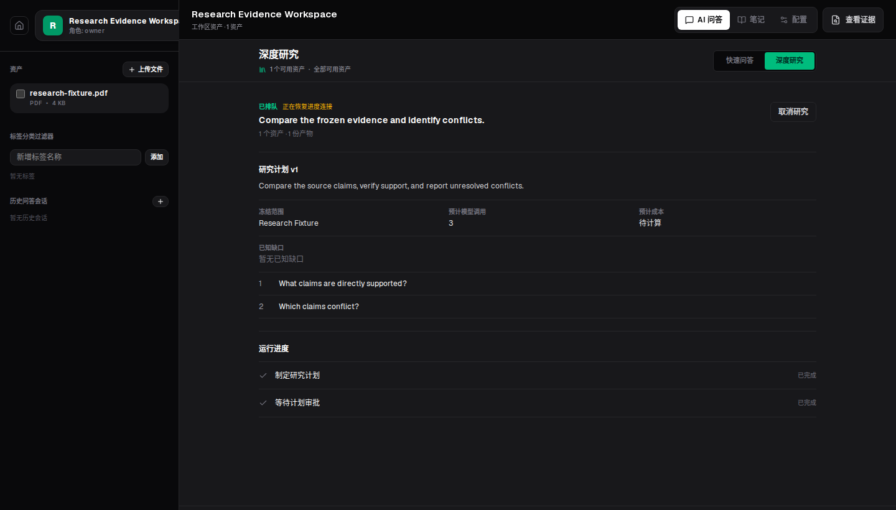

# Citeframe

[](https://github.com/Gujiassh/citeframe/actions/workflows/ci.yml)
[](LICENSE)

Citeframe is a self-hosted workspace for reading PDFs and images, asking questions, and keeping notes with links back to the source.



## Features

- Organize PDFs and images in separate workspaces.
- Read original PDF pages and inspect PNG, JPEG, and WebP images in the built-in viewer.
- Process scanned documents and images with OCR.
- Ask questions across all ready assets or a selected set.
- Open citations at the exact PDF page, PDF region, or image region.
- Search with PostgreSQL full-text search, pgvector, and reciprocal rank fusion.
- Use quick answers for focused questions or research runs for larger comparisons.
- Save source-linked notes, tags, chat history, and research artifacts.
- Run the complete stack on your own infrastructure.

## Getting Started

### Requirements

- Node.js 22+
- pnpm 10.33.4
- Python 3.12+
- [uv](https://docs.astral.sh/uv/)
- Docker with Compose
- An OpenAI-compatible Responses API endpoint
- Ollama with `qwen3-embedding:0.6b`, or another configured embedding provider

### Install dependencies

```bash
pnpm install --frozen-lockfile
uv sync --project apps/api --extra dev
uv sync --project apps/worker --dev
```

### Start local services

```bash
docker compose -f infra/docker/compose.yml up -d
uv run --project apps/api alembic -c apps/api/alembic.ini upgrade head
```

The development Compose file starts PostgreSQL, Redis, and MinIO. The Web, API, and Worker processes run on the host.

### Configure the application

Create the Web environment file:

```bash
cp apps/web/.env.example apps/web/.env.local
```

Set a shared `AI_PDF_API_INTERNAL_TOKEN` for the Web BFF and API, then configure the generation and embedding providers for the API and Worker. The API and Worker must use the same embedding provider, model, and index version.

See [API configuration](apps/api/README.md), [Worker configuration](apps/worker/README.md), and [Docker configuration](infra/docker/README.md) for the available environment variables.

### Run Citeframe

Open three terminals from the repository root:

```bash
pnpm dev:web
```

```bash
pnpm dev:api
```

```bash
pnpm dev:worker
```

Open [http://localhost:3000](http://localhost:3000), create an account, and start a workspace.

## Deployment

The deployment Compose file builds and runs the complete stack behind Caddy.

```bash
cp infra/docker/.env.deploy.example infra/docker/.env.deploy
```

Fill in the passwords, shared token, session secret, model configuration, and site address, then run:

```bash
docker compose \
  --env-file infra/docker/.env.deploy \
  -f infra/docker/compose.deploy.yml \
  up -d --build
```

The [deployment guide](infra/docker/README.md) covers configuration, health checks, logs, metrics, backups, and restores.

## Development

```bash
# Web
pnpm --dir apps/web test
pnpm --dir apps/web lint
pnpm --dir apps/web exec tsc --noEmit

# API and Worker
uv run --project apps/api pytest apps/api/tests
uv run --project apps/worker pytest apps/worker/tests
```

## Repository Layout

```text
apps/web/       Next.js application and BFF
apps/api/       FastAPI service and database migrations
apps/worker/    ingestion, OCR, embeddings, and research jobs
infra/docker/   development and deployment Compose files
packages/       shared TypeScript packages and prompt contracts
docs/           product, architecture, operations, and design notes
specs/          versioned feature specifications
```

## Documentation

- [Product design](docs/ssot/product-design.md)
- [System architecture](docs/ssot/system-architecture.md)
- [Research workflow](docs/architecture/research-workflow-runtime.md)
- [Web development](apps/web/README.md)
- [API development](apps/api/README.md)
- [Worker development](apps/worker/README.md)
- [Deployment](infra/docker/README.md)

## License

Citeframe is licensed under the [Apache License 2.0](LICENSE).
