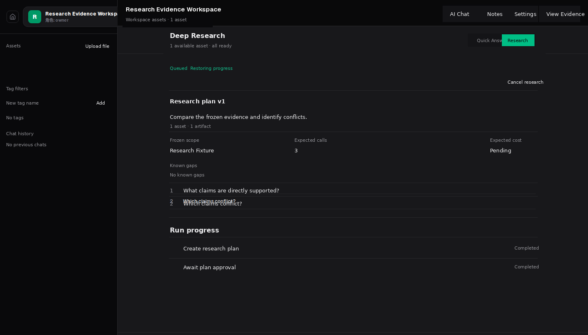

# Citeframe

[](https://github.com/Gujiassh/citeframe/actions/workflows/ci.yml)
[](LICENSE)

Citeframe is a self-hosted multimodal AI knowledge workspace for organizing heterogeneous assets, asking evidence-grounded questions, conducting research, and preserving traceable knowledge.



## What it does

- Organize assets in isolated workspaces with source-linked context.
- Ingest PDF, images (PNG/JPEG/WebP), Markdown documents, HTML, DOCX, XLSX, PPTX, audio, and video. PDF and image workflows offer the deepest visual evidence support; other formats support retrieval and citations with format-specific viewers.
- Preserve typed evidence locations for pages, regions, and image areas.
- Search across ready assets with PostgreSQL full-text search, pgvector, and reciprocal rank fusion.
- Use Quick Answer for focused questions or bounded multi-agent Research for complex comparisons.
- Save source-linked notes, tags, chat history, and research artifacts.
- Configure generation (OpenAI Responses / DeepSeek Anthropic Messages), embedding (OpenAI / Ollama), vision/image-caption, and ASR through server-resolved provider profiles. Requests report an explicit error when a required capability is unavailable.
- Extend format support through modality adapters that share the Asset/Evidence model.
- Run the complete stack on your own infrastructure.

Citeframe is in **Preview**. Format support varies in depth, and answer quality depends on the configured models and source material. Model-quality evaluation and validation with target users are still pending.

## Getting Started

### Requirements

- Node.js 22+
- pnpm 10.33.4
- Python 3.12+
- [uv](https://docs.astral.sh/uv/)
- Docker with Compose
- An OpenAI-compatible Responses API endpoint for the current generation baseline
- Ollama with `qwen3-embedding:0.6b`, or another configured embedding provider

### Install dependencies

```bash
pnpm install --frozen-lockfile
uv sync --project apps/api --extra dev
uv sync --project apps/worker --dev
```

### Start local services

```bash
docker compose -f infra/docker/compose.yml up -d
uv run --project apps/api alembic -c apps/api/alembic.ini upgrade head
```

The development Compose file starts PostgreSQL, Redis, and MinIO. The Web, API, and Worker processes run on the host.

### Local environment profiles

- **preview** — use this profile for product Q&A with your configured models. Embedding defaults to local Ollama; generation requires your own API key. The stack can start without a generation key, and requests that need it return an explicit configuration error.
- **accept** — use deterministic test responses for automated checks. These responses do not measure model answer quality.

Keep API keys in local environment files; the preview template includes no model API key.

See [`docs/guides/local-environment.md`](docs/guides/local-environment.md) and:

```bash
cp infra/env/preview.env.example infra/env/preview.local.env
# optional: add AI_PDF_OPENAI_API_KEY in preview.local.env for chat/caption/ASR
# ensure Ollama is up with qwen3-embedding:0.6b for real embeddings
infra/scripts/citeframe-local-env.sh preview start --with-web
```

### Configure the application

Create the Web environment file:

```bash
cp apps/web/.env.example apps/web/.env.local
```

Set a shared `AI_PDF_API_INTERNAL_TOKEN` for the Web BFF and API, then configure the generation and embedding providers for the API and Worker. The API and Worker must use the same embedding provider, model, and index version.

See [model configuration](docs/guides/model-configuration.md), [local profiles](docs/guides/local-environment.md), and [deployment configuration](docs/deployment/README.md) for environment variables and capability requirements.

### Run Citeframe

Open three terminals from the repository root:

```bash
pnpm dev:web
```

```bash
pnpm dev:api
```

```bash
pnpm dev:worker
```

Open [http://localhost:3000](http://localhost:3000), create an account, and start a workspace.

## Deployment

The deployment Compose file builds and runs the complete stack behind Caddy.

```bash
cp infra/docker/.env.deploy.example infra/docker/.env.deploy
```

Fill in the passwords, shared token, session secret, model configuration, and site address. New deployments use the explicit Compose project `citeframe`; use the actual existing project name for an existing stack and for its backups/restores. Changing the project name selects different named volumes. Then run:

```bash
docker compose \
  --project-name citeframe \
  --env-file infra/docker/.env.deploy \
  -f infra/docker/compose.deploy.yml \
  up -d --build
```

The [deployment guide](docs/deployment/README.md) covers configuration, health checks, logs, metrics, backups, and restores.

## Development

```bash
# Web
pnpm --dir apps/web test
pnpm --dir apps/web lint
pnpm --dir apps/web exec tsc --noEmit

# API and Worker
uv run --project apps/api pytest apps/api/tests
uv run --project apps/worker pytest apps/worker/tests
```

## Repository Layout

```text
apps/web/       Next.js application and BFF
apps/api/       FastAPI service and database migrations
apps/worker/    ingestion, OCR, embeddings, and research jobs
infra/docker/   development and deployment Compose files
packages/       shared TypeScript packages and prompt contracts
docs/           product, architecture, operations, and design notes
specs/          versioned feature specifications
```

## Documentation

- [Documentation index](docs/README.md)
- [Workspace guide](docs/guides/workspaces.md)
- [Supported formats and limitations](docs/guides/format-support.md)
- [Model configuration](docs/guides/model-configuration.md)
- [System architecture](docs/architecture/system.md)
- [Research execution](docs/architecture/research-workflow-runtime.md)
- [Deployment](docs/deployment/README.md)
- [Development and tests](docs/development/README.md)
- [Contributing](CONTRIBUTING.md)
- [Security](SECURITY.md)

## License

Citeframe is licensed under the [Apache License 2.0](LICENSE).
